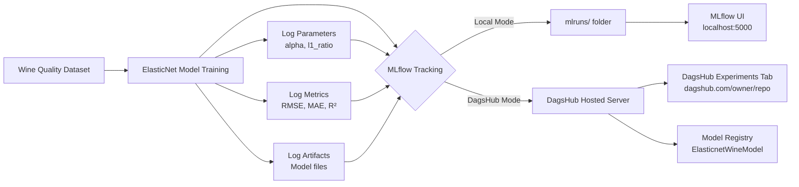

# MLflow + DagsHub mini demo

This tiny project shows how to use MLflow to track a simple scikit-learn model locally, and how to switch the exact same code to log to DagsHub for hosted experiment tracking and a model registry.

## What is MLflow?

MLflow is an open-source MLOps toolkit that helps you:
- Track experiments: log parameters, metrics, and artifacts for each run
- Package and serve models: standard model formats and deployment tools
- Register models: manage model versions and stages (Staging/Production)


Learn more: https://mlflow.org/

## What is DagsHub?

DagsHub is a platform built on top of open tools (Git, DVC, MLflow) that provides hosted experiment tracking, data/model versioning, and collaboration. When you point MLflow to DagsHub, runs appear in your repo's Experiments tab with charts, artifacts, and model registry.


Learn more: https://dagshub.com/

## How it's practiced in this project

### Project Workflow



<p align="center"><i>The workflow shows data flowing from the dataset through model training to MLflow tracking, which can store runs either locally or on DagsHub</i></p>

### File of interest: `app.py`

What the script does:
- Loads the Wine Quality dataset
- Trains an ElasticNet regressor (scikit-learn)
- Logs with MLflow:
	- params: `alpha`, `l1_ratio`
	- metrics: `rmse`, `mae`, `r2`
	- artifacts: serialized model (`model/`)
- If the tracking store is not a local file store, it also registers the model as `ElasticnetWineModel`

Where runs go:
- By default: local MLflow “file store” under `mlruns/`
- If you provide a DagsHub repo and token, `app.py` calls `dagshub.init(..., mlflow=True)` so MLflow logs to your DagsHub repo (hosted tracking server)

Quick knobs:
- Pass hyperparameters: `python app.py <alpha> <l1_ratio>` (defaults are `0.5 0.5`)
- Provide DagsHub repo either as:
	- third CLI arg: `python app.py <alpha> <l1_ratio> owner/repo` or full repo URL
	- environment variable: `DAGHUB_REPO=owner/repo`

## Setup

Requirements: Python 3.9+ recommended.

Install dependencies (Windows PowerShell):

```powershell
python -m venv .venv
.\.venv\Scripts\Activate.ps1
pip install -r requirements.txt
```

If you don’t want a venv, you can just run `pip install -r requirements.txt` in your active environment.

## Run locally (MLflow file store)

```powershell
python app.py 0.5 0.5

# Optional: open the MLflow UI to explore runs stored in ./mlruns
mlflow ui
# then visit http://127.0.0.1:5000
```

Artifacts and metrics will appear under `mlruns/0/...` (already present in this repo from prior runs).

Note: Model Registry features require a non-file backend (database-backed MLflow server). That’s why `app.py` only registers the model when the tracking URI isn’t a local file path.

## Run with DagsHub (hosted tracking)

1) Set a DagsHub token and repo (PowerShell syntax):

```powershell
$env:DAGHUB_TOKEN = "<your_dagshub_token>"
$env:DAGHUB_REPO  = "owner/repo"   # or full URL like https://dagshub.com/owner/repo
```

2) Run the script (the third arg is optional if `DAGHUB_REPO` is set):

```powershell
python app.py 0.3 0.7
# or
python app.py 0.3 0.7 owner/repo
```

`app.py` will print the active MLflow tracking URI. When initialized with DagsHub, it looks like:

```
DagsHub initialized for owner/repo; MLflow tracking URI: https://dagshub.com/api/v1/mlflow
```

3) View your runs in DagsHub:
- Navigate to: `https://dagshub.com/<owner>/<repo>/experiments`
- You’ll see parameters, metrics charts, artifacts (model), and if applicable, a registered model named `ElasticnetWineModel`.

Tips:
- If you see a warning like “DAGHUB_REPO provided but 'dagshub' package is not installed”, run `pip install dagshub`.
- `DAGHUB_TOKEN` can also be provided via `DAGHUB_API_TOKEN` (either works in this script).

## What gets logged

- Parameters: `alpha`, `l1_ratio`
- Metrics: `rmse`, `mae`, `r2`
- Artifacts: trained model under `model/`
- Model Registry: registers `ElasticnetWineModel` when using a non-file tracking backend (e.g., DagsHub)

### MLflow UI Example

## Repository layout (relevant pieces)

```
mlruns/                # local MLflow runs (file store)
	0/                   # default experiment
		<run_id>/
			metrics/         # logged metrics
			params/          # logged params
			artifacts/model/ # saved model
app.py                 # training script with MLflow + optional DagsHub integration
```

## Troubleshooting

- Dataset download fails: ensure you have internet access (the Wine Quality dataset is fetched at runtime).
- Model doesn’t appear in registry: use DagsHub or another MLflow server (not the local file store).
- Authentication issues on DagsHub: verify `$env:DAGHUB_TOKEN` is set in the same shell session before running.

---

Made for quick practice with MLflow tracking locally and on DagsHub. Tweak `alpha`/`l1_ratio` and compare runs side-by-side.

